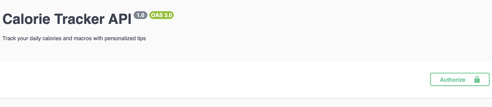
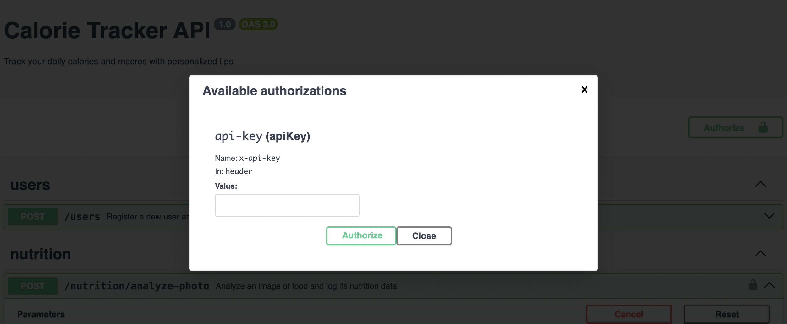

## Description

This project contains a set of APIs built with NestJS with the purpose of implement a calorie tracker application. It includes features such as user authentication, meal logging, and calorie tracking.

## Project setup

1. Install dependencies

```bash
$ npm install
```

2. Create a `.env` file in the root directory of the project using `env.template` as a template. This file will contain the environment variables required for the application to run.

3. Start the MongoDB service. If you are using Docker, you can run the following command:

```bash
$ docker compose up -d
```

4. Ensure that you have the OpenAI API key set in your `.env` file. You can obtain an API key from the [OpenAI website](https://platform.openai.com/signup).

5. Use one of the following methods to run the application:

```bash
# development
$ npm run start

# watch mode
$ npm run start:dev

# production mode
$ npm run start:prod
```

## Usage

App is deployed on `Render` and can be accessed at the following URL: [https://track-calories.onrender.com](https://track-calories.onrender.com). The MVP is made of the following endpoints:

- `POST /user`: Register a new user and receive an API key.
- `POST /nutrition/analyze-photo`: Analyze a photo of a meal to get the nutritional information and log a meal.
- `POST /nutrition/foods`: Get a list of foods based on a search query.
- `GET /nutrition/macros`: Get your daily calorie intake and macronutrient breakdown.

## API Documentation

You can access the API documentation at the following URL: [https://track-calories.onrender.com/docs](https://track-calories.onrender.com/api).

## Example API Requests

1. **User Registration**

In order to start usiung the application, you need to register a user. You can do this by sending a POST request to the `/user` endpoint with the following body:

```typescript
{
  username: "your_username",
  age: 25,
  weight: 70,
  height: 175,
  objective: 'lose_weight' | 'keep_weight' | 'gain_weight',
  physicalActivity: 'low' | 'medium' | 'high'
}
```

You will receive an API key in the response, which you will need to use for subsequent requests.

```json
{
  "apiKey": "c2753ec0-cb5a-4785-a2b7-34d05dd2476f"
}
```

**\_Note:** The API key is required for all subsequent requests to the API. You should send it in the headers as `x-api-key`.

If you are using swagger you can add this header in the "Authorize" section.




2. **Analyze Photo**

To analyze a photo of a meal, you can send a POST request to the `/nutrition/analyze-photo` endpoint after registering a user. The request should include the photo in the body as a file upload, and the API key in the headers.:

3. **Get Foods**

To get a list of foods based on a search query, you can send a POST request to the `/nutrition/foods` endpoint.

4. **Get Macros**

To get your daily calorie intake and macronutrient breakdown, you can send a GET request to the `/nutrition/macros` endpoint.

## Testing

In order to use the endpoints go to [https://track-calories.onrender.com/docs](https://track-calories.onrender.com/docs) and follow the instructions in the documentation.
